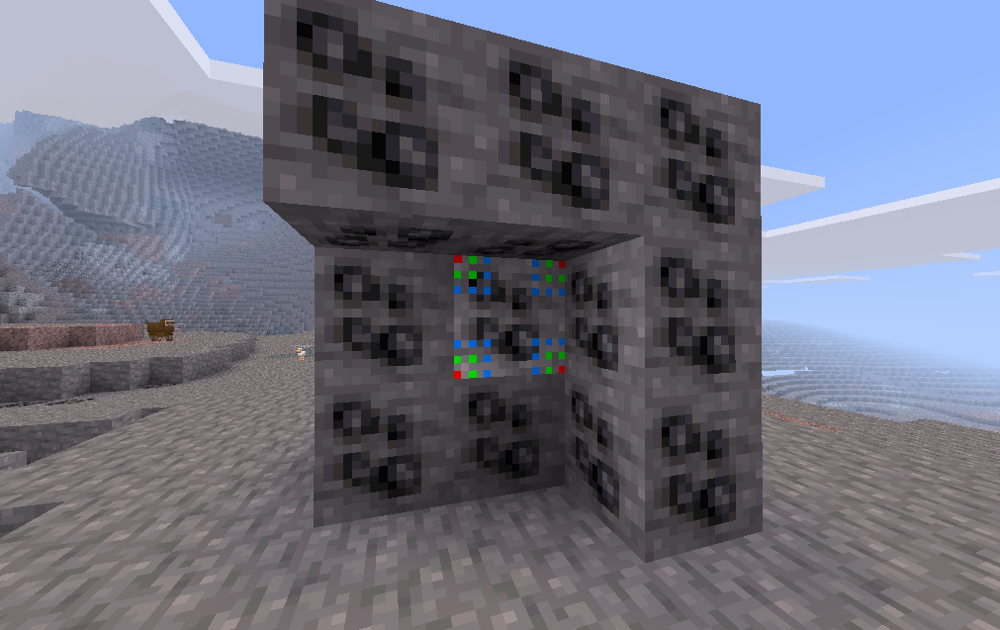
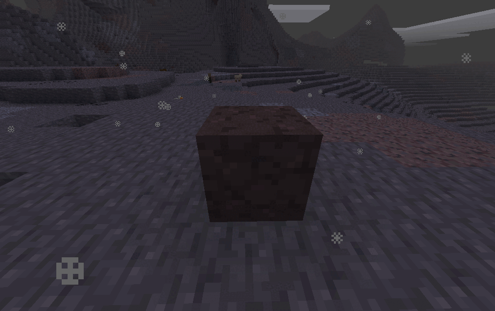

# oreveins
A node which produces ores for Minetest

* [Github Repo](https://github.com/Beanzilla/oreveins)

## What's in the box

* Public [API](API.md) for registering your mod's ores so your mod's ores can have oreveins too.
* Simplistic node which uses a node timer to "generate" ores in a radius around itself.

## Usage

For optimal performance of a orevein place a block down then place the orevein,
 on top them break the block under the orevein,
 make sure there is a 3x3x3 space with the orevein in the middle of that.

## Mods Supported

* MTG (default)
* MCL (mcl_core)
* MTG EXTERN (technic) \*
* MTG EXTERN (moreores) \*

\* These mods are not directly part of a game but I added support for anyway (They can be game specific, I.E. Technic only works in MTG)
